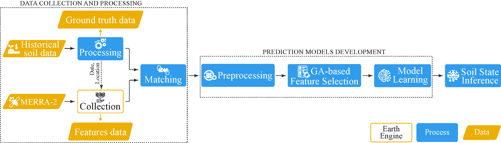

# Freeze-Thaw (FT) cycles
This repository contains the data and code for the research paper titled **"Predicting Freeze-Thaw States in Alaska Permafrost Landscapes using Climate Reanalysis and Machine Learning."** This project aims to enhance the accuracy of FT cycles detection models by leveraging insitu soil tempearture data and reanalysis data (MERRA-2). The proposed framework integrates machine learning algorithms and feature selection techniques to improve permafrost thaw management and proactive efforts in Alaska.

